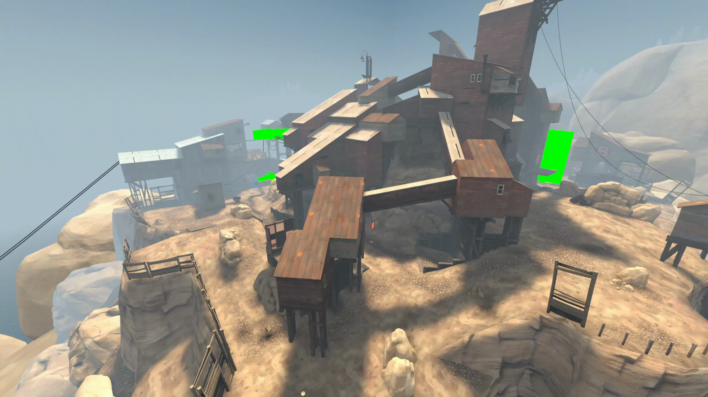

# VSWeather: Automagic Weather Particles For Your TF2 Maps

*Slowed down and visualized*

## What It Do
VSWeather traverses your maps navmesh and runs thousands upon thousands of traces, collision checking as many parts of your map as possible to generate accurate info_particle_system placement with little manual cleanup afterwards.  Anywhere this script doesn't place weather effects, you probably need to use collision particles.

You can export the results to either a VMF instance for further fine-tuning, or a script file to execute in your server config to add weather effects to existing maps.

Your mileage will vary depending on your map's layout, included in the `vs_weather/examples/` folder is a collection of pre-generated instances/scripts for showing the types of maps it does (and doesn't) work best on.  If your map has open skies with little solid geometry blocking skybox visibility (pl_upward, pl_snowycoast, vsh_distillery), you should be good to go.  If your map has confined outdoor space and tight alleyways or overhanging cranes/stuff (cp_mercenarypack 1st point, pl_badwater), you're definitely gonna need a smaller particle system than the `env_rain_002_256` example for this to work well.

None of the example outputs were modified afterwards, all of them were generated using the provided default config (with the exception of pl_enclosure, `ALL_NAV_CORNERS_SLOW` was set to false).

## Nav Generator
If your map does not have a navmesh, the `.wnav create` command will automatically handle multi-stage and other types of maps that struggle with the basic `nav_generate` command.  After generating the nav, you can use `.wnav cleanup` to automatically subdivide large nav areas and disconnect unreachable ones ([credit to Mikusch and ficool2 for the nav disconnect script](https://tf2maps.net/downloads/disconnect-unreachable-adjacent-nav-areas.16744/))

## Installing/Using
- Click the `< > Code` dropdown button at the top of this page and select `Download ZIP`
- Open the ZIP, open the `VScript-Weather-main` folder, drop the `scripts/` folder into your `tf/` folder.

See `tf/scripts/vscripts/vs_weather/CONFIG.nut` for usage and configuration.

## Chat Commands
- `.wstart` start the weather particle placement process.
- `.wsave <instance|script>` save the results to a VMF instance or script file.
- `.wreload`/`.wreset` reload the script for config changes.  Use this command instead of re-executing the main script.
- `.wnav <create|cleanup|subdivide|disconnect>` navmesh utilities, self-explanatory.
- `.whelp` simply prints every chat command.

Debug Commands (probably not super useful):
- `.wtest` Traces and visualizes the closest nav area to see why it was skipped.  **Run `.wreload` after using this**
- `.wtrace` runs TraceLineEx from your current view angles and dumps the results to console.
- `.wfailed` draws all failed trace jobs.  Pretty useless.

## Limitations/Bugs
- Doesn't support angled weather effects (yet).

- Only one particle system at a time.  If you want multiple different weather effects on the same map, edit your config and re-run.
    - Does anyone actually do this ...?

- Obscenely complex/large navs (pl_enclosure) can sometimes hit `SQQuerySuspend` when initializing.
    - See `CONFIG.nut` for workarounds.

- The AVOID_THESE_ENTS config setting is really awful under-the-hood and slapped in last minute.  If you're exporting a VMF you should probably just fix these manually.
    - If you really need to use it (tons of func_brushes or something), set TRACE_FUNCS way lower than normal to avoid `SQQuerySuspend`.

- Setting `SPAWN_PARTICLES` too high may cause overlapping particles, ignoring the `radius` and `overlap_mult` settings.

## FAQ
- **This thing sucks and doesn't work at all for my map**
    - Play around with `CONFIG.nut` and see if you can get it to work better before writing it off.  You might need a smaller/narrower particle system.

- **I'm getting a bunch of "does not exist" errors in console**
    - You did not use `.wreload`/`.wreset` and tried to `script_execute vscript_weather` a second time.
    - Run `ent_fire __vs_weather* Kill` in console, then `script_execute vscript_weather`.
    - This may also happen after getting `SQQuerySuspend` errors, run `.wreload` if this happens.

- **I'm getting a bunch of "Script terminated by SQQuerySuspend" errors**
    - See `tf/scripts/vscripts/vs_weather/CONFIG.nut` for more info.

- **It worked but now I'm hitting the edict limit in playtests**
    - The MAX_EDICTS check only checks if spawning our particles will hit the limit, it doesn't account for players/other entities that may spawn later.

- **I set `developer 2` and now my game is completely frozen and busted when I open console or chat from all the debug message spam**
    - Yea my bad, don't do this for now...

## Credit/License
You are free to use the generated weather instances and scripts as you please, including commercial use, credit me if you want.  That being said, the `.wnav disconnect` and `.wnav cleanup` commands rely on a modified version of the script for disconnecting unreachable areas, consult those credits if you use these features.

If this script helped you and you want to support me, slide me a fat <1% on your map on the workshop or something idk.  Not required.
